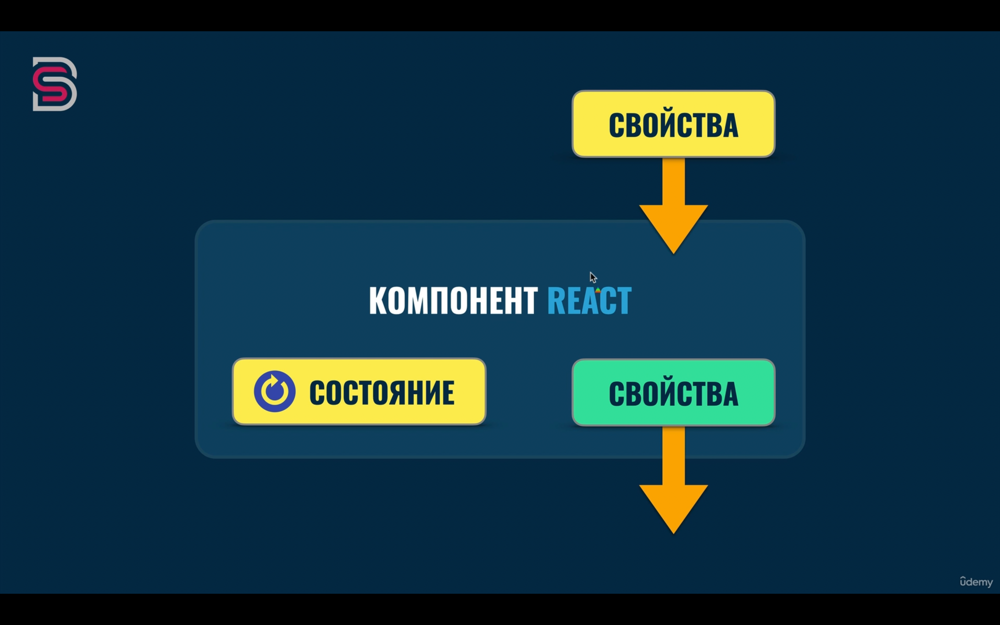

# Принципы изменения свойств и состояния

Компонент _не должен_ изменять собственные **свойства**.

Компонент _может_ изменять **_собственное состояние_**.

Компонент **не может** изменять **состояние** других компонентов.

**Можно** передавать часть своих **_свойств_** и **состаяния** дочерним компонентам в виде **_свойств_**
